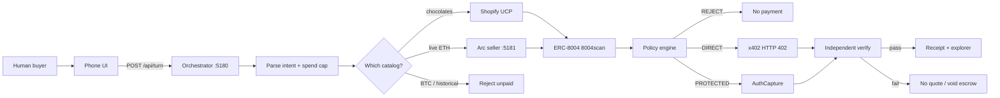
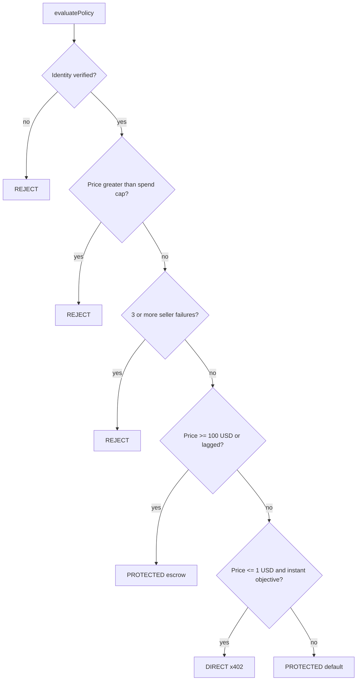
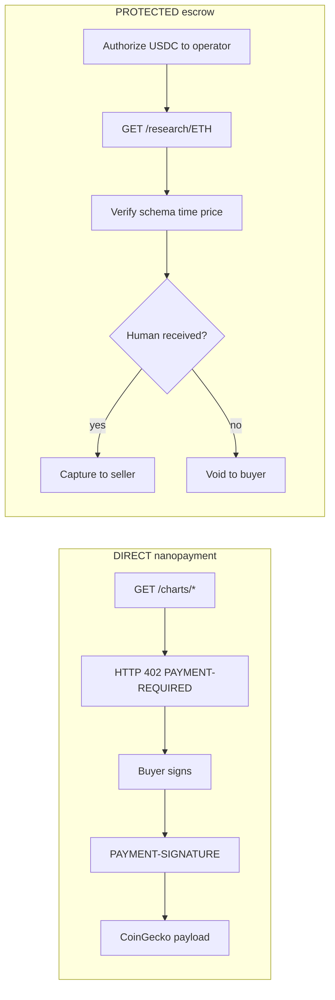

# AgentARC

Track 1: **Best Agentic Economy Application with Circle Agent Stack**.

A buyer agent holds a Circle Agent Wallet, discovers **our Arc x402 chart seller**, reads live ERC-8004 identity, applies policy, and pays in USDC. Dust calls (ETH tick, OHLC) settle as **Nanopayments** via HTTP 402. The research memo uses **AuthCapture escrow**.

There is no public x402 seller on Arc testnet, so this repo runs one.

## Links

| Field | Value |
|---|---|
| **Project** | AgentARC |
| **Repo** | https://github.com/ysbobde2002/AgentARC |
| **Live demo** | https://agentarc-production.up.railway.app |
| **Architecture** | https://agentarc-production.up.railway.app/architecture |
| **Presentation** | https://canva.link/zc8k9kynpnxexvi |

## Run

```bash
cp .env.example .env
npm install
npm run demo
```

- Buyer / UI: [http://localhost:5180](http://localhost:5180)
- Arc x402 seller: [http://localhost:5181](http://localhost:5181)
- Architecture: [http://localhost:5180/architecture](http://localhost:5180/architecture), also the **Architecture** button at the bottom-left of the demo
- Live demo: [https://agentarc-production.up.railway.app](https://agentarc-production.up.railway.app)
- Presentation: [https://canva.link/zc8k9kynpnxexvi](https://canva.link/zc8k9kynpnxexvi)

```bash
curl -i http://localhost:5181/charts/ETH
# HTTP 402 Payment Required · network eip155:5042002
```

Try:

- `Get me the current ETH price. Spend up to $0.05` → DIRECT nanopayment
- `Get ETH chart details. Spend up to $0.05` → DIRECT OHLC
- `Buy the ETH research memo. Spend up to $150` → PROTECTED escrow
- Same memo with **Simulate seller failure** → void
- `Buy the ETH research memo. Spend up to $50` → reject

Until Circle env vars are pasted, payments run in **adapter** mode. Paste `CIRCLE_API_KEY` + `CIRCLE_ENTITY_SECRET`, run `npm run setup:wallets`, fund at [faucet.circle.com](https://faucet.circle.com).

Do **not** paste Ethereum Sepolia EOA private keys. Circle Agent Wallets come from `npm run setup:wallets`.

## Architecture

High-level loop: a shopping or chart prompt becomes an Arc USDC payment only after identity, policy, and (for escrow) independent verification.



### Policy engine (`src/policy.ts`)

First matching rule wins. Fail closed. Reputation is a count, never a single score.



| If | Then |
|---|---|
| ERC-8004 identity missing | REJECT |
| Price > spend cap | REJECT |
| ≥ 3 recent seller failures | REJECT |
| Price ≥ $100, or lagged / subjective | PROTECTED AuthCapture |
| Price ≤ $1, instant, objective (ETH tick / OHLC) | DIRECT x402 nanopayment |
| Else | PROTECTED |

### Two rails



Identity: buyer [#9638](https://testnet.8004scan.io/agents/sepolia/9638) · seller [#6832](https://testnet.8004scan.io/agents/sepolia/6832) on ERC-8004 Sepolia via 8004scan.

## Seller catalog

| Path | Price | Rail |
|---|---|---|
| `GET /charts/ETH` | 0.01 USDC | x402 402 |
| `GET /charts/ETH/ohlc` | 0.02 USDC | x402 402 |
| `GET /research/ETH` | 100 USDC | escrow, then GET |

Circle Agent Marketplace is a **price-band signal only**. Those listings are not on Arc.

## Circle products used

- **Agent Stack** — Agent Wallets, Marketplace discovery (median), Nanopayments
- **USDC** — unit of account, gas, payment asset
- **Circle Wallets** — buyer / seller / operator
- **Nanopayments + Gateway** — batched USDC against this seller
- **Circle Contracts** — `AgentJobEscrow` authorize / capture / void

## Layout

```
cli/serve.ts                 buyer UI + orchestrator (:5180)
cli/seller.ts                Arc x402 chart seller (:5181)
src/seller/                  catalog, HTTP 402, buyer client
src/orchestrator.ts          discover → trust → policy → pay → verify → settle
src/policy.ts                DIRECT vs PROTECTED
src/trust.ts                 live ERC-8004
src/circle/                  Wallets, nanopayments, escrow
ui/architecture.html         high-level design
docs/SUBMISSION.md           bounty write-up
```
