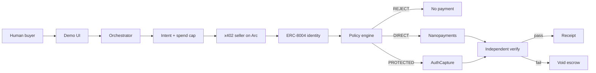
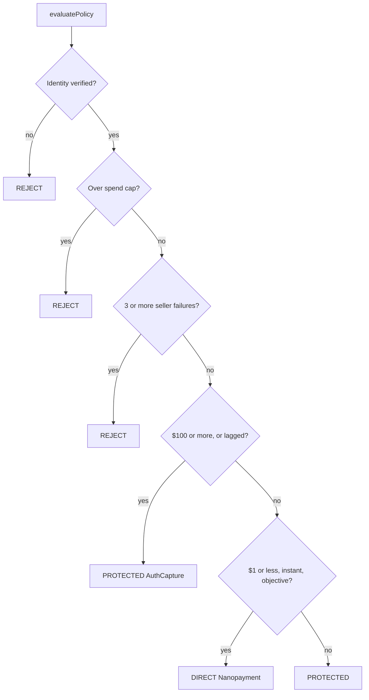

# AgentARC

Track 1: **Best Agentic Economy Application with Circle Agent Stack**

Build autonomous agents that transact on Arc. A buyer agent holds a Circle Agent Wallet, finds a payable service, decides whether to pay, and settles in USDC. Small live ETH calls are **Nanopayments**. The research memo uses **AuthCapture escrow**.

## Links

| Field            | Value                                                                                                              |
| ---------------- | ------------------------------------------------------------------------------------------------------------------ |
| **Project**      | AgentARC                                                                                                           |
| **Repo**         | [https://github.com/ysbobde2002/AgentARC](https://github.com/ysbobde2002/AgentARC)                                 |
| **Live demo**    | [https://agentarc-production.up.railway.app](https://agentarc-production.up.railway.app)                           |
| **Architecture** | [https://agentarc-production.up.railway.app/architecture](https://agentarc-production.up.railway.app/architecture) |
| **Presentation** | [https://canva.link/zc8k9kynpnxexvi](https://canva.link/zc8k9kynpnxexvi)                                           |

## What we built

A working frontend and backend. Agents hold wallets, spend USDC, and settle jobs on Arc using Circle Agent Stack.

- `Get me the current ETH price. Spend up to $0.05` · DIRECT nanopayment
- `Get ETH chart details. Spend up to $0.05` · DIRECT OHLC
- `Buy the ETH research memo. Spend up to $150` · PROTECTED escrow, then capture or void

## The four problems

### Identity

Who is this agent, and who do they represent? How do you refuse a wallet that has no identity at all?

Circle Agent Wallets give the buyer and seller a real USDC identity on Arc. We fail closed if ERC-8004 identity is missing. Only that wallet is allowed to spend.

- Circle Agent Wallets
- ERC-8004 · fail closed if identity is missing

Buyer [#9638](https://testnet.8004scan.io/agents/sepolia/9638) · seller [#6832](https://testnet.8004scan.io/agents/sepolia/6832)

### Discovery and intent matching

What did the human actually want, and which service can take USDC for it? How do you avoid paying the wrong seller, or overpaying?

We parse intent and the spend cap from the prompt. Circle Agent Marketplace gives a live price band. The thing we actually pay is our own x402 seller on Arc, because Circle's public index has no Arc listing yet.

- Natural-language intent + spend cap
- x402 seller on Arc
- Circle Agent Marketplace (median only)

### Policy engine

Should this agent pay at all? If yes, is this a nanopayment, or does the money need to sit until delivery is proven?

Policy is ours. Circle supplies the two rails: Nanopayments for small instant jobs, AuthCapture escrow for large or lagged ones. Overspend, missing identity, or a bad seller is a reject. No USDC leaves the Agent Wallet.

- Reject: no identity / over spend cap / 3 or more failures
- DIRECT: $1 or less, instant, objective → Nanopayments
- PROTECTED: $100 or more, or lagged → AuthCapture

### Protected settlement

If the seller fails, how does the buyer get the money back without a chargeback? If they deliver, how does the seller stay paid?

On Arc we authorize USDC into escrow, verify independently, then capture to the seller or void to the buyer. After capture it is final. Nanopayments skip the hold because the amount is dust.

- Buyer: void / refund before capture
- Merchant: capture is final · no chargebacks
- AuthCapture: authorize → verify → capture or void
- Nanopayments: instant, no per-call refund

## Architecture

A prompt becomes an Arc USDC payment only after identity, policy, and (for escrow) independent verification.

## Seller catalog

| Path                   | Price     | Rail               |
| ---------------------- | --------- | ------------------ |
| `GET /charts/ETH`      | 0.01 USDC | Nanopayment        |
| `GET /charts/ETH/ohlc` | 0.02 USDC | Nanopayment        |
| `GET /research/ETH`    | 100 USDC  | AuthCapture escrow |

## Circle products

- **Arc** · where the agents transact
- **USDC** · unit of account, gas, and payment asset
- **Agent Stack** · Agent Wallets, Marketplace (median only), Nanopayments
- **Circle Wallets** · buyer, seller, and operator
- **Circle Contracts** · `AgentJobEscrow` authorize, capture, void

